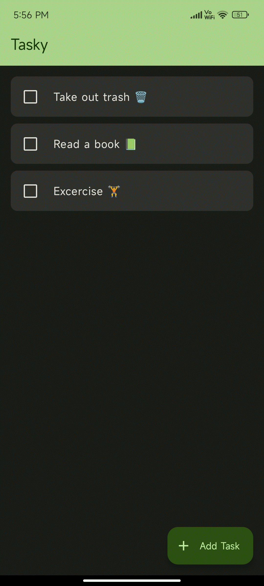

# Tasky
Tasky is a highly intuitive and easy-to-use todo list application designed for those who seek a powerful yet minimalistic way to manage their daily tasks. 

## Features ⭐️

1. Modern and minimal design
2. Notifications for tasks
3. Material You Dynamic theming
4. Repeating tasks everyday.
5. Cool task completion animation
6. Add and Delete Sounds
7. Completely offline making it privacy first
8. Free and Open Source
9. Offline Backups

## Screenshot 🌠

<table>
  <tr>
    <td> </td>
   </tr> 
</table>

## Download ⬇️

Note: Updates arrives slower on Google Play Store and F-droid store. The apps must be checked by playstore while rebuilt completely on f-droid. Playstore usually delays updates by few hours or 1 day to be max in most cases while F-droid can take upto 4 days to show latest releases. So if you want faster releases you can get it from github or wait for playstore to make update available.
