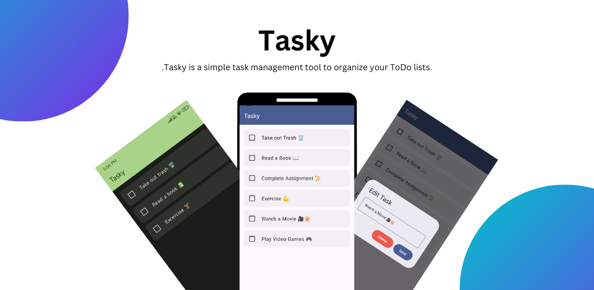

# Tasky
Tasky is a highly intuitive and easy-to-use todo list application designed for those who seek a powerful yet minimalistic way to manage their daily tasks. 

## Features ⭐️
- Modern Design
- Notifications for tasks
- Material You Dynamic theming
- Add and Delete Sounds
- Minimal Design
- Completely Offline making it privacy first

## Disclaimer ⚠️

Starting from version 1.5, Tasky package name is being changed to `com.thatsmanmeet.taskyapp` 
from `com.thatsmanmeet.tasky` because someone have uploaded my app to Play Store without changing
package name and hence I have to rename my app to upload it to Play Store.

So, please remove your old version of tasky and download the new one as this will also be available
on Play Store.

I am really sorry for this inconvenience.

## Technologies 🛠️
- [Kotlin](https://kotlinlang.org/) - First class and official programming language for Android development.
- [Jetpack Compose](https://developer.android.com/jetpack/compose?gclid=CjwKCAiArOqOBhBmEiwAsgeLmUlv4dbl6KV3yBs7SXOpYReSF8DaG5yWJipHnkO-OEWgyMHgjn1BixoC8bUQAvD_BwE&gclsrc=aw.ds) - Jetpack Compose is Android’s modern toolkit for building native UI.
- [Material 3](https://m3.material.io) - Material Design 3, Google’s most expressive and adaptable design system
- [Coroutines](https://kotlinlang.org/docs/reference/coroutines-overview.html) - For asynchronous and more.
- [Android Architecture Components](https://developer.android.com/topic/libraries/architecture) - Collection of libraries that help you design robust, testable, and maintainable apps.
    - [ViewModel](https://developer.android.com/topic/libraries/architecture/viewmodel) - Stores UI-related data that isn't destroyed on UI changes.
    - [Room](https://developer.android.com/training/data-storage/room) - Room is an android library which is an ORM which wraps android's native SQLite database
- [Material Components for Android](https://github.com/material-components/material-components-android) - Modular and customizable Material Design UI components for Android.

## Architecture ⚙️

This app uses [***MVVM (Model View View-Model)***](https://developer.android.com/jetpack/docs/guide#recommended-app-arch) architecture.

## Screenshots 🌠

<table>
  <tr>
    <td> </td>
    <td> </td>
    <td></td>
      <td></td>
   </tr> 
</table>

## Download ⬇️

Or Go to releases page and download the latest `app-release.apk` from the latest release tag.

## Contribute 🤝🏻

We welcome and encourage contributions to our app, and we value your input. By creating pull requests, you have the opportunity to make a valuable impact on the app's functionality, user experience, and overall quality. We appreciate any contributions that you make, and we thank you for your support.

