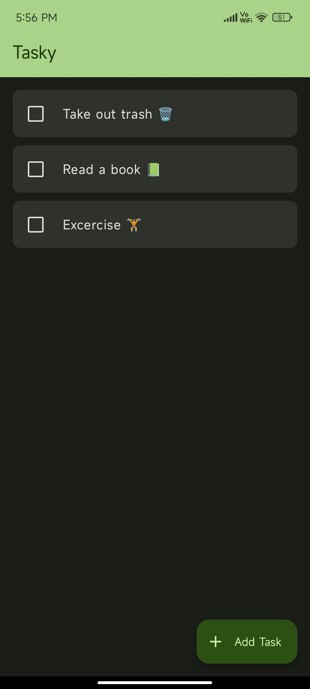
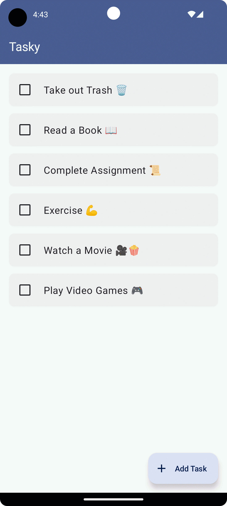
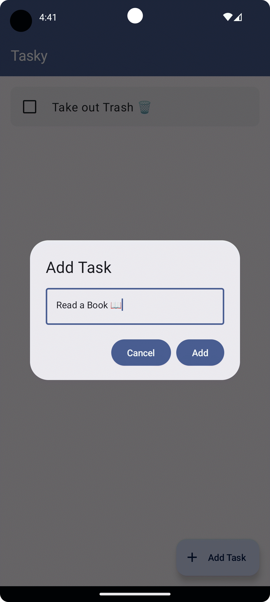
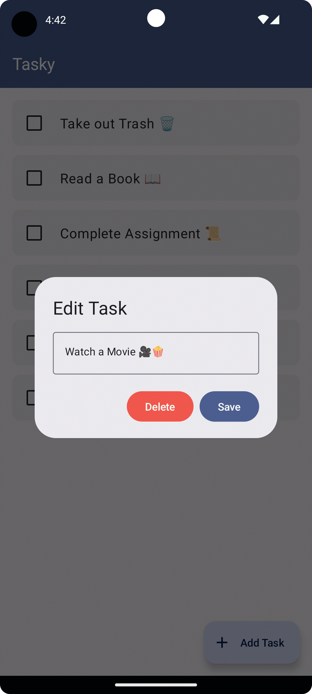

# Tasky

Tasky is a simple todo list app built with Material 3 and Jetpack Compose.

## Features ⭐️
- Modern Design.
- Notifications for tasks
- Material You Dynamic theming.
- Add and Delete Sounds.
- Minimal Design.
- Completely Offline making it privacy first.

## Technologies 🛠️
- [Kotlin](https://kotlinlang.org/) - First class and official programming language for Android development.
- [Jetpack Compose](https://developer.android.com/jetpack/compose?gclid=CjwKCAiArOqOBhBmEiwAsgeLmUlv4dbl6KV3yBs7SXOpYReSF8DaG5yWJipHnkO-OEWgyMHgjn1BixoC8bUQAvD_BwE&gclsrc=aw.ds) - Jetpack Compose is Android’s modern toolkit for building native UI.
- [Material 3](https://m3.material.io) - Material Design 3, Google’s most expressive and adaptable design system
- [Coroutines](https://kotlinlang.org/docs/reference/coroutines-overview.html) - For asynchronous and more..
- [Android Architecture Components](https://developer.android.com/topic/libraries/architecture) - Collection of libraries that help you design robust, testable, and maintainable apps.
    - [ViewModel](https://developer.android.com/topic/libraries/architecture/viewmodel) - Stores UI-related data that isn't destroyed on UI changes.
    - [Room](https://developer.android.com/training/data-storage/room) - Room is an android library which is an ORM which wraps android's native SQLite database
- [Material Components for Android](https://github.com/material-components/material-components-android) - Modular and customizable Material Design UI components for Android.

## Architecture ⚙️

This app uses [***MVVM (Model View View-Model)***](https://developer.android.com/jetpack/docs/guide#recommended-app-arch) architecture.

## Screenshots 🌠

  
 

## Download ⬇️

](https://apt.izzysoft.de/fdroid/index/apk/com.thatsmanmeet.tasky)

Go to releases page and download the latest `app-release.apk` from the latest release tag.

## Contribute 🤝🏻

You can contribute to this app by creating pull requests. Thank you.

